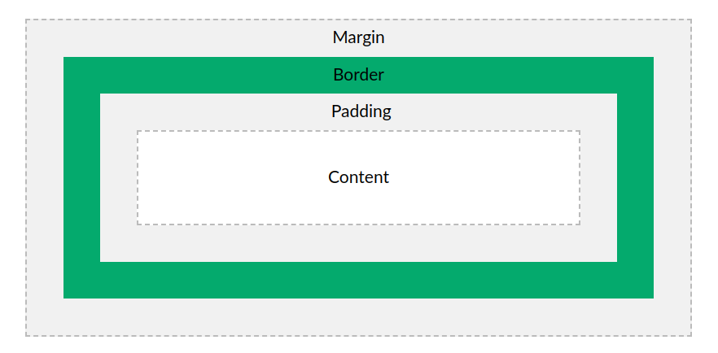

# CSS - Style Sheets Cascade

Es un **lenguaje de diseño** que permite **definir y crear estilos** para un documento HTML.

Las hojas de estilo en cascada o CSS, son un simple mecanismo que describe cómo se va a mostrar un documento en la pantalla.

> Es posible también definir estilos para un documento impreso. 

## Conceptos generales

### Sintaxis
Las hojas de estilo están formadas por reglas, cada regla
está formada por un selector. El selector contiene una o varias declaraciones. Cada declaración está conformado por un nombre de pripiedad y su valor (es).

    /* <------- regla -------->  */
    <selector> {
    	/*bloque de declaraciones*/
        <propA>: <valorX>;
        <propB>: <valorY> <valorZ> ... ;
    }
    
    /* Comentario multilinea */

### Incluir CSS a una página

+ **Inline CSS**: Va dentro el tag html

    ```html
    <h1 style="color:blue;"> ... </h1>
    ```

    > Usar solo para modificaciones puntuales.

+ **Internal CSS**: Van dentro de la cabecera del documento HTML

    ```html
    <head>
        <style>
            h1 {color: blue;}
        </style>
    </head>
    ```

    > Se usa cuando hay pocos estilos.

+ **External CSS** (recomendable): Todo el CSS se escribe en un archivo separado con extensión `.css`

    Este archivo se enlaza en la cabecera del documento HTML:
    ```html
    <head>
        <link rel="stylesheet" href="ruta/estilos.css">
    </head>
    ```

### Herencia en CSS
Implica que los estilos que damos a los padres, se aplicarán también en los los hijos a menos que especifiquemos lo contrario.
```html
# estilos
body { color: red; }

# html
<body>
    <h1>Titulo</h1>
    <p> Esto es un párrafo </p>
</body>

# El texto de los tags h1 y p serán rojas por la herencia. 
```

### Dimensiones
+ px: medida absoluta
+ em: realtivo al font-size de si mismo o del padre mas próximo
+ rem: relativo al font-size del tag html
+ %: porcentaje relativo al contenedor padre


### Selectores

+ **universal**: selecciona todos los tags 
  
    ```
    * { box-sizing: border-box; }
    ```
+ **etiqueta**: selecciona tags especificados
  
    ```
    h1 { ... }
    p { ... }
    img { ... }, etc
    ```
+ **clase**: selecciona todos los tags que tiene el atributo "class" con un valor especificado. Por ejemplo consideremos este tag: `<p class="texto">`
  
    ```
    .texto { ... }
    ```
+ **id**: selecciona el tag con el id especificado. Por ejemplo consideremos el sig. tag: `<p id="miId">` (NO RECOMENDADO)
  
    ```
    #miId { ... }
    ```
+ **grupo**: selecciona varios tags a la vez para compartir atributos comunes
  
    ```
    h1, h2, p { ... }
    ```
+ **descendientes**: selecciona tags hijos específicos. Por ejemplo, consideremos la sig. estructura html: 
  
    ```html
    <ul class="menu">
        <li><a> ... </a></li>
        <li>
        	<ul> 
        		<li><a> ... </a></li>
        		<a> ... </a>
        	</ul>
        </li>
        <a> ... </a>
    </ul>
    ```
    + **descendientes indirectos**: selecciona hijos, nietos y bisnietos
      
        ```css
        .menu li a { ... }
        ```
    + **descendientes directos**: selecciona los hijos directo.
      
        ```css
        .menu > li  { ... } 
        ```
### Especificidad
¿Que pasa si dos estilos para un mismo elemento entran en conflicto? ¿Qué estilo prevalece?

La especificidad nos ayuda a decidir que estilo se aplicará.

Se calcula un puntaje en base al tipo de selector, los estilos del selector que tenga mayor puntaje es el que se aplica.

| Selector  | Puntaje |
| --------- | ------- |
| Universal | 0       |
| Tipo      | 1       |
| Clase     | 10      |
| Id        | 100     |

> Los estilos inline se asigna un **valor de 1000**.

#### ¿Cuantos puntos tiene estos selectores?

    #nabvar .derecha a { ... } tiene 111 puntos
    
    table .sinbordes tr th { ... }  tiene 13 puntos

> En caso de que los puntos sean los mismos, se decide por cascada, es decir, el último selector definido.

Ejemplo

```html
# HTML
<p> Este es un párrafo <span class="resaltado"> importante </span>
</p>

# CSS
.resaltado { background-color: yellow;}

p span { background-color: red;}

¿que fondo se aplica?
```

## Model box

### Modelo de cajas
Siguiendo la lógica de la estructura HTML (padres, hijos, nietos, etc) cada uno de ellos. se los puede entender como cajas que van dentro de otras caja y así sucesivamente.

```css
/* html
<div> <p> .... </p> </div>
*/

div {
    background-color: yellow;
    height: 600px;
    width: 600px;
}

p {
    background-color: pink;
    height: 400px;
    width: 400px;
}
```


Cada caja contiene las siguientes propiedades: margenes, bordes, paddings y su contenido.



> El margin y padding son transparentes

### Ancho y alto

Por defecto, `width` y `height` definen el ancho y alto del **content**.

```css
p {
    width: 350px;
    height: 500px;
}
```

### Márgenes y relleno

margin y padding

### Bordes

Para aplicar bordes se deben considerar necesariamente tres propiedades: **grosor, estilo y color de borde**.

```css
.bordes {
    border-width: 2px;
    border-style: solid;
    border-color: red;
}
```

> Los **valores de estilos** de bordes son: `solid`, `dashed`, `dotted`, `double`, `none` entre los más usados.

<div style="border-width: 2px;
    border-style: solid;
    border-color: red;">Ejemplo</div>

Estas propiedades pueden recibir hasta 4 valores, dependiendo cuantos valores se definan se aplicarán los bordes (en sentido horario).

> Es el mismo principio de márgenes (defin. varios valores, en sentido horario).

```css
.bordes-3 {
	border-color: orange; 
    /*naranja a los 4 lados*/
    border-style: dashed solid; 
    /* dashed arriba y abajo*/
    border-width: 3px 5px 2px 4px; 
    /* todos los lados difer.*/
}
```

<div style="border-color: orange; border-style: dashed solid; border-width: 3px 5px 1px 4px">Ejemplo</div>

---

#### **Shorthands**

Es más práctico definir el borde,usando el *shorthand* `border`.

```css
.bordes {
	border: 2px solid red;
}
```

Shorthands por posición (lados del borde).

```css
.bordes-2 {
	border-top: 2px solid red;
	border-right: 3px dashed green;
	border-bottom: 2px solid red;
	border-left: 3px dashed green;
}
```

---

También es posible definir cada lado del borde individualmente (uso menos frecuente)

```css
/* Lados del borde */
border-top-width: 5px;
border-left-color: red;
border-right-style: solid;
border-bottom: blue 7px dashed;
```

#### Bordes redondeados

The `border-radius` property is used

```css
p {
  border: 2px solid red;
  border-radius: 5px;
}
```

### ¿Cuanto ocupa un elemento cuando se define margin, padding, border y tamaño?

### Display block e inline

En html la mayoría de las etiquetas son de dos tipos: `block` o `inline`. Los elementos considerados block ocupan toda el ancho y los elementos inline solo ocupan su contenido, por ejemplo, `div`, `p`, `h1` son elementos block y `span`, `a`, `img` son elemento inline.

```
|<-------------------- div (block) ------------------>|

|<-span (inline)->|<-span (inline)->|<-span (inline)->|
```

Con css podemos alterar este comportamiento que viene por defecto, haciendo que un elemento block se convierta en inline y viceversa.

```css
.enlinea {
	display: inline;
}

.bloque {
    display: block;
}
```

## Color

Los colores se pueden asignar a propiedades como: **background** (fondo), **color** (letra), **border** (bordes). Se pueden de definir de varias maneras.

### Nombres de colores

Existen palabras clave como `red`, `yellow`, etc. que permiten asignar colores, estos son nombres de colores predefinidos. 

Según la w3school. actualmente todos los navegadores soporta 140 colores: https://www.w3schools.com/colors/colors_names.asp

```css
.color {
	background-color: darkblue; /*fondo*/
    color: white; 				/*texto*/
}
```

> Una página muy útil para encontrar nombres agrupados por colores : https://147colors.com/

### Valores rgb

Se puede definir el color mediante los componentes RGB, siguiendo la siguiente sintaxis: `rgb(R, G, B)`, donde:

+ R es el componente Rojo y los valores van del 0 a 255.
+ G es el componente Verde y los valores van de 0 a 255.

+ B es el componente Azul y los valores van de 0 a 255

> 0 indica ausencia de color y 255 color al 100%. Blanco es rgb(0, 0, 0) y negro rgb(255, 255, 255) 

```css
.color-rgb {
	background-color: rgb(255, 165, 0);
}
```

### Valores hexadecimales

Se puede definir colores mediante valores hexadecimales siguiendo la siguiente sintaxis: `#RRGGBB`, donde:

+ RR es el componente Rojo y los valores son de 00 a ff.
+ GG es el componente Verde y los valores son de 00 a ff.

+ BB es el componente Azul y los valores son de 00 a ff.

> 00 indica ausencia de color y ff color al 100%

```css
.color-hex {
	background-color: #ff6347;
}
```

> Si los dos valores de cada pareja son iguales se puede abreviar:
> `#55ff33 = #5f3`

### Colores con transparencia (opacidad)

Para añadir transparencia se debe agregar un nuevo valor (alpha):

- `color: #RRGGBBAA` AA toma valores entre 00 y FF, donde 00 totalmente transparente y FF sin transparencia
- `color: rgb(R, G, B, A)` A toma valores reales entre 0 y 1, donde 0 indica totalmente transparente y 1 sin transparencia. 

## Imágenes

Para las imágenes no se tienen propiedades específicas, pero es recomendable definir el tamaño en el css y no en la etiqueta html.

De preferencia usar valores relativos "%" y no valores absolutos "px", para que las imágenes se puedan acomodar al tamaño de las pantallas.

```css
img {
	width: 100%;
    height: auto;
}
```

> **stockSnap.io**  para descargar imágenes sin copyright.

### Imagen de fondo

```
background-image: url('../ruta/de-la/imagen.png');
```

> ¿En que ocasiones es mejor usar esto? a comparación de ``

### Ejercicio 7: Aplicar margenes, paddings, colores, fondo

## Fuentes y Textos

### Familia de fuentes o tipografia

Se puede establecer una o varias familias de fuentes, existen familias de fuentes gratuitos y de paga, como: Arial, Times New Roman, Ubuntu, etc.

También existen familias de **fuentes genéricas**:

+ `serif`: Con adorno (serifa), sus terminales son pronunciadas.
+ `sans-serif`: Sin adorno (de palo seco)
+ `cursive`: Letras inclinadas
+ `monospace`: Cada caracter ocupa el mismo espacio horizontal (ideal para escribir código)

Para definir una familia de fuente para tu página es:

```css
body {
	font-family: Arial;
}
```

### Fuentes alternativas

En caso de que el usuario no tenga instalado la fuente *Arial* en su máquina, se puede definir **fuentes alternativas**:

```css
body {
	font-family: Arial, Ubuntu, sans-serif;
}
```

> Se recomienda definir como por lo menos una fuente genérica.

### Google Fonts

Muchas veces ocurre que el usuario no tiene instalado las fuentes, en estos casos es mas recomendable usar el servicio de Google Fonts.

Google Fonts provee mas de 1000 fuentes libres para usar en nuestras páginas web.

A continuación detallo los pasos para añadir una fuente:

1. Ir a la pagina de [Google Fonts](https://fonts.google.com/)
2. Seleccionar la fuente.
3. Seleccionar el/los weight/s (grosor). (*sug. elegir 3 max.*) 
4. Click en el ícono "View selected families", copiar el código `<link ... >` y pegar en el *`<head>`* del documento html.
5. Especificar la familia de fuentes en el css `font-family: 'Montserrat'`

> otro proveedor de servicio de fuente es [Adobe](https://fonts.adobe.com/) (no gratuito)

### Tamaño de fuente

Para definir el tamaño de fuente

```css
p {
	font-size: 16px;
}
```

> También es posible usar tamaños relativos, (lo veremos en clases)

### Grosor de fuente

Los grosores de fuentes mas usados son: `light`,`normal`, `bold`

```css
strong {
	font-weight: bold;
}
```

Para fuentes de Google Fonts lo mas común es usar valores numéricos: 100, 200, ... , 900, donde 100 es el mas delgado  y 900 el mas grueso.

```css
.texto-grueso {
    font-weight: 900;
}
```

### Estilos de fuente

Existen tres estilos que se pueden aplicar: `normal`, `italic` y `oblique`

```css
.frase {
	font-style: italic;
}
```

> ¿Cual es la diferencia entre oblique e italic?

### Decoración de texto

La propiedad`text-decoration` se usa para añadir una linea horizontal en el texto, sus variantes son: `underline` (línea <u>baja</u>), `overline` (linea encima), `line-through` (linea en ~~medio~~ ) y `none`.

```css
a {
	text-decoration: none; 
}
```

> El uso más común es quitar el subrayado de los links, valor `none`.

### Alineación de texto

Hay tres posibilidades para alinear texto: `left`, `center` o `right`.

```css
.texto-centrado {
	text-align: center;
}
```

### Transformación de textos

CSS da la posibilidad de transformar los textos en: `uppercase`, `lowercase` o`capitalize`

```css
.mayus {
	text-transform: uppercase;
}
```

### Tarea: Descargar fuentes y enlazar al sitio web

### Ejercicio 8

Modificar el texto del blog

## Iconos

La manera más simple de añadir iconos es con la libreria Font Awesome.

```

```

---

## Más Estilos

### Estilo para listas

Con CSS podemos definir el tipo de icono que se mostrará en una lista.
Dependiendo del tipo de lista se usaran diferentes valores.

+ Para `<ol>` son: `lower-roman`, `upper-roman`, `lower-alpha`, `upper-alpha`. `decimal`(default), `decimal-leading-zero` y `lower-greek`.

  ```css
  ol {
  	list-style-type: lower-roman;
  }
  ```

  > Números romanos (lower-roman, upper-roman), abecedario (lower-alpha, upper-alpha), numeros decimales (decimal) y con leading-zero se añade un 0 por delante (01, 02, etc.), letras griegas (lower-greek)

+ Para `<ul>` son:  `circle`, `disc`(default), `square`.

  ```css
  ul {
  	list-style-type: square;
  }
  ```

**<ul> para el menú de navegación**
Es común usar `<ul>` para construir el menú de navegación, donde cada `<li>` será un elemento del menú. Si se quiere hacer un menú horizontal será necesario cambiar su comportamiento a `inline-block` porque por defecto es elemento block.

```css
nav ul li {
	display: inline-block;
}
```

### Estilos en links

Los link presentan varios estados y dependiendo del estado sus estilos pueden cambiar.

Los estados son:

- `a:link` - es el estado normal, el link no fue visitado
- `a:visited` - el usuario ya visitó el link. 
- `a:hover` - el mouse esta sobre el link
- `a:active` - justo cuando el usuario hace click sobre el link.

```css
a:hover {
	color: green;
}
```

Ver ejemplo https://www.w3schools.com/css/tryit.asp?filename=trycss_link

Como se dijo anteriormente, es muy usual quitar el subrayado de los links

```css
a {text-decoration: none;}
```

### Estilos en formularios

Dar estilos a un formulario de "Registrarse", con todo lo aprendido hasta ahora.

### Estilos en tablas

simplemente usar los estilos ya conocidos.


### Ejercicio 9

Aplicar estilos de a links, tablas, formularios del blog.
