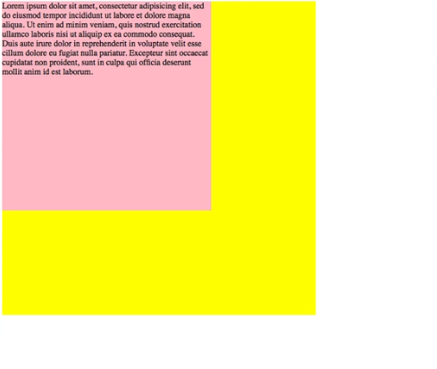
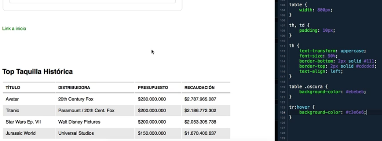

# CSS - Style Sheets Cascade

Es un **lenguaje de diseño** que permite **definir y crear estilos** para un documento HTML.

Las hojas de estilo en cascada o CSS, son un simple mecanismo que describe cómo se va a mostrar un documento en la pantalla.

> Es posible también definir estilos para un documento impreso. 

## Conceptos generales

### Selectores
Es a través de estos selectores que se definen los estilos.
Los selectores tiene propiedades y las propiedades pueden tener diferentes valores

    <selector> {
        <propA>: <valorX>;
        <propB>: <valorY> <valorZ>;
    }

### Incluir CSS a una página

+ **Inline CSS**: Va dentro el tag html

    ```html
    <h1 style="color:blue;"> ... </h1>
    ```

    > Usar solo para modificaciones puntuales.

+ **Internal CSS**: Van dentro de la cabecera del documento HTML

    ```html
    <head>
        <style>
            h1 {color: blue;}
        </style>
    </head>
    ```

    > Se usa cuando hay pocos estilos.

+ **External CSS** (recomendable): Todo el CSS se escribe en un archivo separado con extensión `.css`

    Este archivo se enlaza en la cabecera del documento HTML:
    ```html
    <head>
        <link rel="stylesheet" href="ruta/estilos.css">
    </head>
    ```

### Herencia en CSS
Implica que los estilos que damos a los padres, se aplicarán también en los los hijos a menos que especifiquemos lo contrario.
```html
# estilos
body { color: red; }

# html
<body>
    <h1>Titulo</h1>
    <p> Esto es un párrafo </p>
</body>

# El texto de los tags h1 y p serán rojas por la herencia. 
```

### Dimensiones
+ px: medida absoluta
+ em: realtivo al font-size de si mismo o del padre mas próximo
+ rem: relativo al font-size del tag html
+ %: porcentaje relativo al contenedor padre


### Selectores

+ **universal**: selecciona todos los tags 
  
    ```
    * { font-family: sans-serif }
    ```
+ **tipo**: selecciona tags especificados
  
    ```
    h1 { ... }
    p { ... }
    img { ... }, etc
    ```
+ **clase**: selecciona todos los tags que tiene el atributo "class" con un valor especificado. Por ejemplo consideremos este tag: `<p class="texto">`
  
    ```
    .texto { ... }
    ```
+ **id**: selecciona el tag con el id especificado. Por ejemplo consideremos el sig. tag: `<p id="miId">` (NO RECOMENDADO)
  
    ```
    #miId { ... }
    ```
+ **grupo**: selecciona varios tags a la vez para compartir atributos comunes
  
    ```
    h1, h2, p { ... }
    ```
+ **descendientes**: selecciona tags hijos específicos. Por ejemplo, consideremos la sig. estructura html: 
  
    ```
    <ul class="menu">
        <li><a> ... </a></li>
        <li>
        	<ul> 
        		<li><a> ... </a></li>
        		<a> ... </a>
        	</ul>
        </li>
        <a> ... </a>
    </ul>
    ```
    + **descendientes indirectos**: selecciona hijos, nietos y bisnietos
      
        ```
        .menu li a { ... }
        ```
    + **descendientes directos**: selecciona los hijos directo.
      
        ```
        .menu > li  { ... } 
        ```
### Especificidad
¿Que pasa si dos estilos para un mismo elemento entran en conflicto? ¿Qué estilo prevalece?

La especificidad nos ayuda a decidir que estilo se aplicará.

Se calcula un puntaje en base al tipo de selector, los estilos del selector que tenga mayor puntaje es el que se aplica.

| Selector  | Puntaje |
| --------- | ------- |
| Universal | 0       |
| Tipo      | 1       |
| Clase     | 10      |
| Id        | 100     |

> Los estilos inline se asigna un **valor de 1000**.

#### ¿Cuantos puntos tiene estos selectores?

    #nabvar .derecha a { ... } tiene 111 puntos
    
    table .sinbordes tr th { ... }  tiene 13 puntos

> En caso de que los puntos sean los mismos, se decide por cascada, es decir, el último selector definido.

Ejemplo

```html
# HTML
<p> Este es un párrafo <span class="resaltado"> importante </span>
</p>

# CSS
.resaltado { background-color: yellow;}

p span { background-color: red;}

¿que fondo se aplica?
```

## Margenes y colores

### Modelo de cajas
Siguiendo la lógica de la estructura HTML (padres, hijos, nietos, etc) cada uno de ellos. se los puede entender como cajas que van dentro de otras caja y asi sucesivamente.

```css
/*
<div> <p> .... </p> </div>
*/

div {
    background-color: yellow;
    height: 600px;
    width: 600px;
}

p {
    background-color: pink;
    height: 400px;
    width: 400px;
}
```



### Márgenes y relleno

margin y padding

### Bordes

```
/* En una sola línea */
border: 3px dotted green;

/* Por separado */
border-color: blue;
border-style: double;
border-width: 2px;

/* Lados del borde */
border-top-width: 5px;
border-left-color: red;
border-right-style: solid;
border-bottom: blue 7px dashed;
```

Algunos valores de border-style

- `dotted` - Defines a dotted border
- `dashed` - Defines a dashed border
- `solid` - Defines a solid border
- `double` - Defines a double border
- `none` - Defines no border
- `hidden` - Defines a hidden borde

### Color

Existen dos formas de establecer colores:

+ Valor hexadecimal: `color: #RRGGBB` donde los valores de RR, GG, BB está entre 00 y FF.
+ Valor decimales: `rgb(R, G, B)` donde los valores de R, G y B está entre 0 y 255.

Para añadir transparencia se debe agregar un nuevo valor:

- `color: #RRGGBBAA` AA toma valores entre 00 y FF, donde 00 totalmente transparente y FF sin transparencia
- `color: rgb(R, G, B, A)` A toma valores reales entre 0 y 1, donde 0 inidica totalmente transparente y 1 sin transparencia. 

### Imagen de fondo

```
background-image: url('../ruta/de-la/imagen.png');
```

> **stockSnap.io**  para descargar imagenes sin copyright

### Display inline y block

```
display: inline | block;
```

### Ejercicio 7: Aplicar margenes, paddings, colores, fondo

## Fuentes y Textos

### Familia de fuentes y tamaños

```css
font-family: Arial, sans-serif;
```

`Arial` será la fuente principal y `sans-serif` el secundario  en caso que no se encuentre Arial instaladas en las pc.

> Las fuentes genéricas son: serif, sans-serif, monospace, cursive, fantasy.

```css
font-size: 16px;
```

### Grosor y estilos

```css
font-weight: (normal|bold|light) || (100|200|...|900);
font-style: italic|normal|oblique;
```

> 100, 200, ... 900 son utilizados para fuentes externas como Google Fonts.

> italic y oblique algunas fuentes las diferencian. ¿buscar ejemplo?

### Suvizado de bordes de texto

> sugerencia usar solo en títulos (h1) por que el cambio es leve.

```
-webkit-font-smoothing: antialiased;
text-rendering: optimizelegibility;
```

### Tranformar textos

```
text-transform: uppercase|lowercase|capitalize
```

### Decorar texto

```
text-decoration: underline|overline|line-through|none
```

<u>underline</u>, overline (sobre la linea), ~~line-through~~ y none (usado para quitar el subrayado de los links)

### Alinear texto     

```
text-align: left|center|right
```

### Google fonts

1. ir a la pagina de Google Fonts
2. seleccionar la tipografia.
3. seleccionar el/los weight/s (sug. elegir 3 max.)
4. copiar el tag y pegar en el *head* de la pagina web.

### Ejercicio 8

Modificar el texto del blog

## Más Estilos

### Estilo para listas

```
ol {
   list-style-type: lower-roman|upper-roman|lower-alpha|upper-alpha|decimal(default)|decimal-leading-zero|lower-greek; 
}

ul {
    list-style-type: circle|disc(default)|square;
    list-style-position: outside(default)|inside;    
}

ul {
	list-style-image: url("ruta/icono.png");    
}
```

> Números romanos (lower-roman, upper-roman), abecedario (lower-alpha, upper-alpha), numeros decimales (decimal) y con leading-zero se añade un 0 por delante (01, 02, etc.), letras griegas (lower-greek)

### Estilos en formularios

Dar estilos a un formulario de "Registrarse", con todo lo aprendido hasta ahora.

### Estilos en links

```
a {text-decoration: none;}

/*Estados de un link*/
a:visited { ... }
a:hover { ... }
a:active { ... } //cuando se hace clic
```

### Estilos en tablas

simplemente usar los estilos ya conocidos.



### Ejercicio 9

Aplicar estilos de a links, tablas, formularios del blog.
