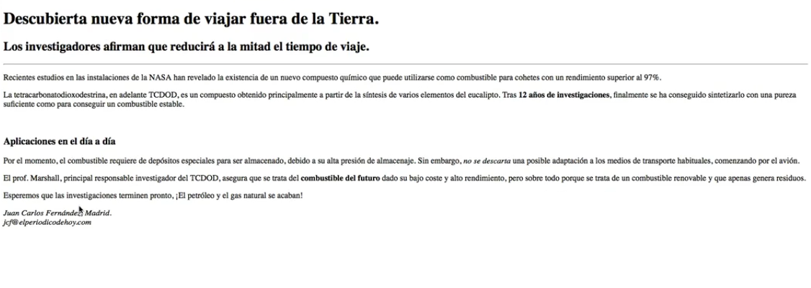
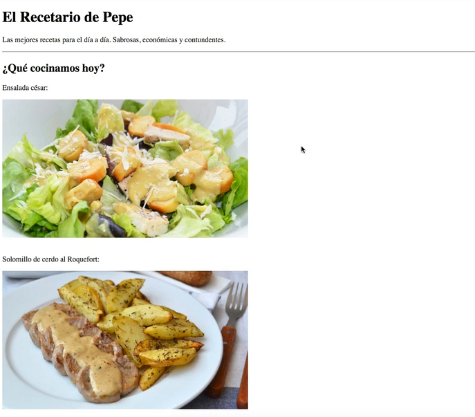
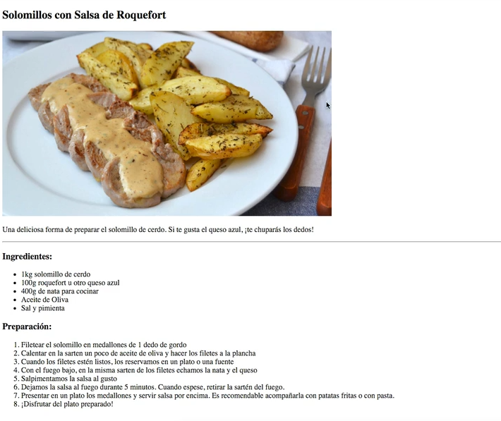
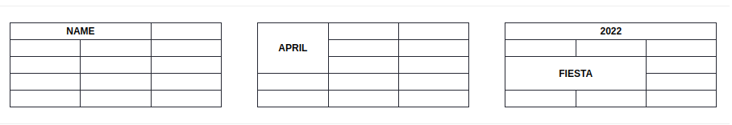
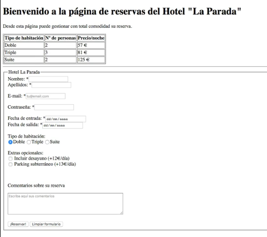

# HTML

## ¿Qué es html?

*HyperText Markup Language*, es un lenguaje que se utiliza para crear documentos en la web.

El *html* define la **estructura semántica** de la página web. A través de etiquetas (*tags*) podemos estructurar el texto, añadir imágenes, tablas, enlaces, etc.

## Etiquetas y Atributos

### Etiquetas (*tags*)

Las **etiquetas o *tags*** son palabras clave que permite definir la estructura de una página web.

- Van encerrados entre caracteres menor y mayor `<etiqueta>`.

- Por lo general los *tags* son de apertura y cierre `<etiqueta>...</etiqueta>` 

```
    <p>Hola a todos</p>
     ^       ^       ^
     |       |       |
    tag   Content   tag
    open            close
    <<---Elemento HTML--->>
```

> Algunas etiquetas no llevan el tag de cierre p.e. ``.

### Atributos de etiqueta

**Atributos** sirven para añadir mas información a las etiquetas y van dentro de las etiquetas: `<etiq atributo="valor"> ... </etiq>` 

```html
<p lang="es">Hola a todos</p>
```

> **Recomendación**, escribir los atributos en minúsculas.

## Estructura HTML

Hay cuatro **etiquetas clave** en todas las páginas web, estas conforman la **estructura básica** y van en un orden específico:

```html
<!DOCTYPE html>
<html lang="es">
	<head>
    	<!-- Contenido de la cabecera -->
        <meta charset="UTF-8">
    	<title>Mi primera web</title>
    </head>
    <body>
    	<!-- Contenido del cuerpo -->   
        Hola mundo!  
    </body>
</html>
```

### Etiqueta `<Doctype>`

La etiqueta `<!DOCTYPE html>` debe ser el primer elemento del documento, es decir, debe estar en la primera línea de cada página HTML.

Está etiqueta indica al navegador que dicho documento contiene elementos del estándar HTML5.

### Etiqueta `<html>`

El elemento raíz es la etiqueta `<html> ... </html`, dentro esta etiqueta van todos los elementos del lenguaje html.

### Etiqueta `<head>`

Etiqueta `<head> ... </head>` dentro de esta se encuentra la **información relevante para el navegador** (*metadatos*), como el titulo, descripción, autor, *keywords*, etc. Además es usual incluir los estilos y contenido *javascript* en esta sección.

> **Importante**: Esta información **no se visualizará** en el navegador.

#### Etiquetas `<meta>`

Este tipo de etiquetas proporcionan información sobre la página web a los navegadores.

Entre estos son:

- Codificación de caracteres, indicamos al navegador que tipo de codificación de caracteres que se utilizará. 

```html
<meta charset="UTF-8">
```

- También se puede añadir otra información:

```html
<meta name="description" content="Pequeña desc. sobre la pag.">
<meta name="author" content="Juan Perez">
<meta name="keyword" content="Palabras clave para ayudar a indexar a los buscadores">
```

#### Links

Las etiquetas `<link>` nos permiten acceder o incluir contenido externo.

```html
<link rel="stylesheet" href="styles.css" />
<link rel="icon" href="images/icon.png"/>
```

### Etiqueta `<body>`

Dentro de esta etiqueta estará **todo el contenido que se visualizará** en la ventana del navegador `<body> ... </body>`.

### Comentarios

No se visualizarán en el navegador.

```html
<!-- Esto es un comentario -->
```

---

### Ejercicio 1

Crear una página web con la estructura básica, título, contenido (solo texto) y comentarios.

---

## Textos

### Cabeceras y párrafos

**Cabeceras** se usan para los títulos de la página. Tiene 6 niveles, el primer nivel es`<h1>...</h1>`, luego `<h2>...</h2>` y así sucesivamente hasta `<h6>...</h6>`

**Párrafos** `<p>Contenido del párrafo</p>`

```html
<!DOCTYPE html>
<html>
	<head>
        <meta charset="UTF-8">
    	<title>Cabeceras y párrafos</title>
    </head>
    <body>
    	<h1>Título de nivel 1</h1>
        <p>Esto es el contenido de un párrafo</p>
    </body>
</html>
```

### Saltos de linea `<br>`

Al momento de visualizar una página, **los saltos de linea y espacios (dos o mas consecutivos) no serán tomados en cuenta por navegador** y solo tomará un espacio respectivamente.

Para **visualizar los saltos de linea** se usan las etiquetas `<br>` 

> **Nota**: Esta etiqueta no tiene etiqueta de cierre.

```html
<!-- estructura básica -->
<h1>Título de nivel 1</h1>
<p>Esto mi primer párrafo</p>
<br> <!-- esto colocará un espacio adicional entre párrafos-->
<p>Segundo párrafo</p>
<!-- no se toma en cuenta varios espacios seguidos -->
<p>
    Parra con multiples lineas,
    sigue siendo la primera linea,
    <br> <!-- Obliga a colocar un salto de linea -->
    esto es la segunda linea.
</p>
```

### Salto con Linea Horizontal `<hr>`

Añade un salto de linea junto con una linea horizontal.

```html
<!-- estructura básica -->
<h1>Título de nivel 1</h1>
<hr> <!-- Añade una linea horizontal -->
<p>Esto mi primer párrafo</p>
```

### Etiquetas `<strong>` y `<em>`

Se usan para **remarcar semánticamente** los textos.

La etiqueta **Strong** es para indicar que un texto es importante `<strong>...</strong>`.

Y la etiqueta **em** es para dar énfasis a un texto `<em>...</em>`.

> **Nota**: No se debería utilizar estas etiquetas para colocar en negrita o cursiva, en su lugar hacerlo con estilos *css*.

```html
<!-- estructura básica -->
<p>Mi primer párrafo <strong>esto es importante</strong></p>
```

### Abreviaturas `<abbr>`

Esta etiqueta define una abreviación o un acrónimo. Esto aporta información útil a los navegadores, sistemas de traducción y buscadores.

```html
<!-- Acrónimos -->
<p>Las <abbr title="Base de Datos">BD</abbr> sirven para almacenar datos relacionados</p>

<!-- Abreviaturas -->
<p>El <abbr title="Ingeniero">Ing.</abbr> Ramirez es experto en Redes</p>
```

### Citas, definiciones y direcciones

La etiqueta `<citas>` se utiliza para citar: frases, libros, películas, etc.

La etiqueta `<dfn>` se utiliza para marcar el término que se está definiendo.

La etiqueta `<address>` se utiliza para indicar información de contacto.

```html
<!-- estructura básica html -->
<!-- Citas -->
<p><cite>El quijote</cite>, obra de Cervantes, es considerado el primer libro de la era moderna. </p>

<!-- definiciones -->
<p>El <dfn>hiperespacio</dfn> es una forma que tiene cuatro o más dimensiones. </p>

<!-- direcciones -->
<address>
    Autor: Carlos Ramos<br>
    Email: carlos@gmail.com<br>
    Cochabamba, Bolivia.
</address>
```

> A nivel de sintaxis son similares pero a nivel semántico son diferentes.

### Etiqueta `<time>`

Representa o bien una hora (en formato de 24 horas), o una fecha precisa en el calendario gregoriano (en formato [ISO](http://es.wikipedia.org/wiki/ISO_8601))

```html
<p>
  The Cure will be celebrating their 40th anniversary on
  <time datetime="2018-07-07">July 7</time> in London's Hyde Park 
  at <time datetime="20:00">20:00</time>.
</p>

```

### Texto preformateado

#### Etiqueta `<pre>`

El texto se muestra tal como está definido (espacios, salto de lineas, etc.) en el archivo html.

```html
<pre>
Esto es un ejemplo de texto
preformateado.

    Este texto tiene
    una sangría.
</pre>
```

#### Etiqueta `<code>`

Se usa para definir fragmentos de código de programación

```html
<code>
class Hello {
  public void sayHello() {
    System.out.println("Hola mundo")  
  }    
}
</code>
```

---

### Ejercicio 2

Crear la siguiente estructura con etiquetas *html*.



## Listas, enlaces e imágenes

### Listas ordenadas y desordenas

Las listas se utilizan para mostrar una sucesión de elementos, lo cuales podrían tener un orden o no.

- Las **listas ordenadas** se usan cuando los elementos tienen un orden. 

  ```html
  <!-- listas ordenadas -->
  <ol> <!-- ordered list -->
      <li>Item 1</li>
      <li>Item 2</li>
  </ol>
  ```

- En las **listas desordenas** cuando el orden no importa.

  ```html
  <!-- listas desordenadas -->
  <ul> <!-- unordered list -->
      <li>Item 1</li>
      <li>Item 2</li>
  </ul>
  ```

Así mismo se pueden anidar las listas independientemente del tipo.

```html
<!-- listas anidadas -->
<ul>
    <li>Item 1</li>
    <li>Item 2
    	<ol>
            <li>Item 2.a</li>
            <li>Item 2.b</li>
        </ol>
    </li>
</ul>
```

### Listas de definición

Se utilizan para crear listas que contienen términos y sus definiciones, p.e. glosarios, definición de conceptos, etc.

```HTML
<!-- listas de definiciones -->
<dl> <!-- definition list -->
  <dt>HTML</dt> <!-- Termino a definir -->
  <dd>Lenguaje de marcado estándar para crear páginas web.</dd> <!-- Definición del término-->
</dl>
```

### Enlaces

Los enlaces o links sirven para la **navegación entre páginas web internas de un sitio web**, o navegar entre **páginas web** externas.

Los enlaces también permiten obtener un archivo de imagen, vídeo, etc.

Sintaxis:

```html
<a href="direccion/del/recurso">Elemento activador</a>
```

Donde la `direccion/del/recurso` puede ser:

+ **Ruta absoluta**: páginas web externas

  ```
  https://www.empresa-x.com/blog/mipagina.html
  http://<dominio.web>/<subsección>/<archivo>
  ```

+ **Ruta relativa**: páginas web internas

  ```
  servicios/oferta.html
  /productos/lista.html (así toma en cuenta desde el dominio)
  ```
  

Ejemplos:

```html
<!-- Páginas internas -->
<a href="quienes-somos.html">¿Quienes somos?</a>

<!-- Páginas web externas -->
<a href="https://www.google.com">Ir a Google</a>
```

Por defecto, los enlaces abren en la misma pestaña, Para **abrir el enlace en una nueva pestaña** se define el atributo `target="_blank"`.

```html
<!-- Abrir el enlace en una nueva pestaña -->
<a href="https://www.google.com" target="_blank">Ir a Google</a>
```

> **Nota**: `target="_self"` es el valor por defecto.

Navegar entre **zonas de una misma página.**

```html
<!-- Moverse a una zona de la misma página -->
<!-- Primero definir el atrib. id en la zona destino -->
<p id="prologo">
    Aquí esta el resumen ... 
</p>
...
<!-- Definimos el enlace -->
<a href="#prologo" >Ir al prólogo</a>
```

Se puede combinar las páginas y las zonas.

```html
<a href="historia-web.html#prologo" >Ir al prólogo</a>
```

### Imágenes

Breve referencia sobre los atributos de ``:

+ `src=` (*source*), Indica la ruta donde se encuentra la imagen.
+ `alt=` se utiliza para añadir una descripción alternativa de lo que contiene la imagen.
  *En caso de que no cargue la imagen se muestra esta descripción. Es muy útil para los robots, lectores de pantalla.*
+ `width=` ancho de la imagen. Se puede definir en píxeles o en %.
+ `height=` alto de la imagen. Se puede definir en píxeles o en %.

> **Nota**: No se recomienda definir los atributos `width` y `height`, esto se deberia definir con **css**

```html

```

---

### Ejercicio 3

Hacer un recetario, crear dos páginas

**Página 1** - las imágenes son enlaces, imagen-1 enlace a una página externa, la imagen-2 es un enlace a una página interna.



**Página 2** - Receta



---

## Tablas y Formularios

### Tablas

Las tablas tienen filas y columnas.

```html
<!-- Tabla de 2 x 2 -->
<table>
    <tr> <!-- table row -->
        <th>cabecera 1</th> <!-- table header -->
        <th>cabecera 2</th>
    </tr>
    <tr>
        <td>celda 1</td> <!-- table data -->
        <td>celda 2</td>
    </tr>
    <tr>
        <td>celda 3</td>
        <td>celda 4</td>
    </tr>
</table>
```

> **Nota**: Asegurarse que el número de celdas sean las mismas en cada fila.

> **Nota**: By default, the text in `<th>` elements are bold and centered, but you can change that with CSS.

> Adicionalmente se puede añadir más etiquetas semánticas en las tablas:
>
> `<thead>`	Groups the header content in a table
> `<tbody>`	Groups the body content in a table
> `<tfoot>`	Groups the footer content in a table
>
> Una de las ventajas de su uso es, al imprimir una tabla grande que abarca varias páginas, estos elementos pueden permitir que el encabezado y el pie de página de la tabla se impriman en la parte superior e inferior de cada página.
>

----

**Combinación de celdas**

```html
<table>
    <tr>
    	<th>Col 1</th>
    	<th colspan="2">Col 2 y 3</th>
    </tr>
    <tr>
		<td rowspan="2">dato 1 y 4</td>
		<td>dato 2</td>
    	<td>dato 3</td>
    </tr>
	<tr>
		<td>dato 5</td>
    	<td>dato 6</td>
    </tr>
</table>
<!-- 
|----------|-------------------!
| Col 1    | Col 2 y 3         |
|----------|-------------------!
| dato 1   | dato 2  | dato 3  |
| y 4      | --------|---------|
|          | dato 5  | dato 6  |
|----------| --------|---------|
-->
```

---

### Ejercicio:



---

#### Etiqueta `<caption>`

Se usa para definir un **titulo de tabla**.

```html
<table>
    <caption>Título de la tabla</caption>
    <tr>
    	<td>cell 1</td>
        <td>cell 2</td>
    </tr>
</table>

<!-- 
       Título de la tabla
|----------|-------------------!
| dato 1   | dato 2  | dato 3  |
|----------| --------|---------|
-->
```

#### Etiquetas `<colgroup>` y `<col>`

`<colgroup>`se usa para agrupar a una o mas columnas. 

`<col>` especifica el formato para cada columna y va dentro del elemento *colgroup*.

Estas etiquetas son útiles cuando se quiere dar estilos a una columna en vez de hacerlo para cada celda.

```html
<table>
  <colgroup>
    <col> <!--una columna-->
    <col span="2" style="background-color:red">
  </colgroup>
  <tr>
    <th>ISBN</th>
    <th>Title</th>
    <th>Price</th>
  </tr>
</table>
```

> **Nota:** `<colgroup>` debe ir siempre después de la etiqueta <caption> y antes de  <thead>, <tbody>, <tfoot> y <tr>.

### Formularios

Son campos por donde podemos enviar información a un servidor para su procesamiento.

La etiqueta `<form>` se usa para crear el formulario y puede contener distintos tipos de elementos *input*.

```html
<form>
    <!-- varios elementos input -->
</form>
```

> **Note:** The form itself is not visible.

#### La etiqueta `<input>`

Es uno de los más usados, existen distintos tipos.

> **Nota**: El ancho por defecto de un `<input>` es de 20 caracteres.

**Campo de texto**

```html
<form>
    <label for="name">Nombre</label>
    <input type="text" id="name" name="ejemt" placeholder="Escribe tu nombre">
</form>
```

- El elemento `<label>` muestra el nombre del campo.
- El atributo `for`  del `<label>` debe ser igual al `id` del `<input>`. Si el usuario hace click sobre el label. el cursor hace foco en el `<input>`.
- El atributo `name` es como un contenedor que almacenará el dato que ingrese el usuario y es el que se enviará al servidor.

**Radio Button**

Se usa para que el usuario selecciones uno de varias opciones.

```html
<form>
    <input type="radio" name="ejmrb" id="rba" value="op1">
    <label for="rba">opcion 1</label>
    <input type="radio" name="ejmrb" id="rbb" value="op2" checked>
    <label for="rbb">opcion 2 (checked)</label>
    <input type="radio" name="ejmrb" id="rbc" value="op3" disabled>
    <label for="rbc">opcion 3 (disabled)</label>
</form>
```

- El atributo `value` es el valor que se enviará al servidor, solo se enviará el valor del `<input>` seleccionado por el usuario.
- Se puede añadir el atributo `checked` a un `<input>` para indicar que es la opción por defecto.

**Checkboxes**

Se usa para que el usuario elija cero o varias opciones.

```html
<form>
    <input type="checkbox" name="ejemCB[]" id="cba" value="op1" checked>
    <label for="cba">opcion 1 (checked)</label>
    <input type="checkbox" name="ejemCB[]" id="cbb" value="op2">
    <label for="cbb">opcion 2</label>
</form>
```

- El valor del atributo `name` termina en `[]` para indicar que se enviará múltiples valores al servidor.

**Submit Button**

Define un botón que sirve para enviar los datos del formulario.

```html
<form action="register.php">
  <label for="name">Nombre</label>
  <input type="text" id="name">
    
  <input type="submit" value="Registrarse">
</form>
```

**Campo para email y password**

```html
<label for="email">email</label>
<input type="email" name="email" id="email">
<br>
<label for="passw">password</label>
<input type="password" name="contrasena" id="passw">
```

**Area de texto**

```html
<label for="textA">textarea</label>
<textarea id="textA" name="comentario" rows="3" cols="20">
```

**Lista de selección**

```html
<select name="ejemSelect">
    <option value="item1">Item 1</option>
    <option value="item2" selected>Item 2</option>
</select>  
```

**Otros inputs**

```html
<input type="date" name="fecha">

<input type="number" name="cantidad">

<!-- Boton limpiar los campos -->
<input type="reset" value="Limpiar campos">
```

Ejemplo de un formulario.

```html
<form> <!-- Elemento contenedor -->
    <!-- Campos de texto -->
    <fieldset>
    	<legend>Título del fomulario</legend>
        <label for="text1">text (placeholder)</label>
        <input type="text" name="name1" id="text1" placeholder="Escribe tu nombre de usuario">
        <br>
        <label for="text3">text (required)</label>
        <input type="text" name="name3" id="text3" required>
        <br>
        <label for="text4">text (pattern)</label>
        <input type="text" name="name4" id="text4" pattern="\S{5,10}" placeholder="(5-10) caracteres">
        <br>
        <label for="text2">text (readonly)</label>
        <input type="text" name="name2" id="text2" readonly value="por defecto">
        <br>
        <label for="email">email</label>
        <input type="email" name="email" id="email">
        <br>
        <label for="passw">password</label>
        <input type="password" name="contrasena" id="passw">
        <br>
        <label for="textA">textarea</label>
        <textarea id="textA" name="comentario" rows="3" cols="20"></textarea>
    </fieldset>
    
    <!-- Botones -->
    <fieldset>
        <legend>Tipo radio</legend>
        <input type="radio" name="ejemploRadio" value="op1">
        <label>opcion 1</label>
        <input type="radio" name="ejemploRadio" value="op2" checked>
        <label>opcion 2 (checked)</label>
        <input type="radio" name="ejemploRadio" value="op3" disabled>
        <label>opcion 3 (disabled)</label>
    </fieldset>
    <fieldset>
        <legend>Tipo checkbox</legend>
        <input type="checkbox" name="ejemCB[]" value="op1" checked>
        <label>opcion 1 (checked)</label>
        <input type="checkbox" name="ejemCB[]" value="op2">
        <label>opcion 2</label>
    </fieldset>
    <fieldset>
        <legend>Tipo select</legend>
		<select name="ejemSelect">
            <option value="item1">Item 1</option>
            <option value="item2" selected>Item 2</option>
        </select>        
    </fieldset>
    <fieldset>
        <legend>Otros tipos</legend>
		<input type="date" name="fecha">
        <input type="number" name="cantidad">
    </fieldset>
    <input type="submit" name="enviar" value="Guardar">
    <input type="reset" value="Limpiar campos">
</form>
```

---

### Ejercicio 4

Reserva de hotel



---

## Estructura avanzada

### Elementos tipo *block* e *inline*

**Block**: Los elementos *block* **empiezan en una nueva linea**, es decir, que tienen un salto de linea antes del elemento.

```html
<h1>Titulos 1</h1>
<h2>Titulos 2</h2>
 ...
<h6>Titulos 6</h6>
<p>parrafos</p>
 
<!-- Resultado
Titulos 1
Titulos 2
 ...
Titulos 6
parrafos
-->
```

**inline**: Los elementos *inline* se **posicionan en la misma linea**, es decir, no inserta un salto de linea antes del elemento

```html

<a href="#">Enlace</a>
<strong>resaltado</strong>
<em>enfasis</em>
otros

<!-- Resultado
-------
| img |
------- Enlace resaltado enfasis
-->
```

> **Note:** An inline element cannot contain a block-level element!

### Atributos `id` y `class`

Los **id's** identifican elementos de **manera única** *(no debería haber dos id's iguales)*.

Las **clases** identifican elementos que tienen **características comunes**. Se usan generalmente para definir estilos comunes.

```html
<p id="parrafo1">
    Esto es el parrafo 1 ...
</p>
<p class="texto-gris">
    Este parrafo tiene texto color gris ...
</p>
<p id="parrafo3" class="texto-gris borde">
    Este parrafo tiene texto color gris y con borde ...
</p>
```

### Div y span

La etiqueta `<div>` (división) es un elemento ***block*** permite **agrupar elementos o definir una sección**. 

```html
<div class="contenedor">
    <p>Esto es el parrafo 1 ...</p>
	<p>Esto es el parrafo 2 ...</p>
</div>
```

La etiqueta `<span>` es un elemento ***inline*** y permite **definir una "subsección"** generalmente de elementos block para aplicar estilos.

```html
<p><span class="capital">L</span>orem ipsum dolor sit amet adipiscing mi tempor eros litora ullamcorper, <span class="resaltado">elit neque</span> , eget dis nascetu.</p>
```

---

### Ejercicio 5

Crear la estructura de un blog

```
-------------------------------------------------------
         LOS VIAJES DE JULIA
             <Subtitulo>
-------------------------------------------------------
	| MENÚ | DE | NAVEGACIÓN | USAR | TAGS-<ul>
=======================================================
				<ESPACIO PARA LOS POSTS>
	--------------------------------------------
			Título del post1
		|-----------------------|
		|	<imagen del post>	|
		|						|
		|-----------------------|
		<fecha-pub> | <categorias>
		Descripción del posts1 va
		en esta sección ...
		|-----------------------|
		|	<tabla de precios>	|
		|		|		|   	|
		|-----------------------|
		Último parrafo del post1
	--------------------------------------------
	--------------------------------------------
			Título del post2
		|-----------------------|
		|	<imagen del post>	|
		|						|
		|-----------------------|
		<fecha-pub> | <categorias>
		Descripción del posts2 va
		en esta sección ...
	--------------------------------------------
======================================================
		       <GALERIA DE FOTOS>
	|--------------------|--------------------|
	|                    |                    |
	|                    |                    |
	|                    |                    |
	|                    |                    |
	|--------------------|--------------------|
	|                    |                    |
	|                    |                    |
	|                    |                    |
	|                    |                    |
	|--------------------|--------------------|
	
=======================================================
Suscríbete ...
-------------------------------------------------------
|  Nombre: |____________|  Email: |______________|  
|  Acepto las condiciones |_|    |__Suscribirme__|
-------------------------------------------------------
```

---

## Etiquetas semánticas

En la especificación de **HTML5** se introdujeron una serie de etiquetas nuevas con cierto sentido semántico (**etiquetas semánticas**), estas etiquetas **describen el significado de su contenido**. 

Este tipo de etiquetas que componen la web semántica nos sirven para que cualquier mecanismo automático (un navegador, un motor de búsqueda, un lector de *feeds*...) que lea una página web sepa con exactitud la ubicación de las partes que la componen.


### Header

La etiqueta `<header>` es para la sección de la cabecera (la parte superior de un una página), dentro de esta etiqueta está el logotipo, título de la página, podría contener también el menú de navegación, un campo de búsqueda, etc,

```html
<header>
    <a href="/"></a>
    <h1>Title</h1>
</header>
```

> **Importante**: No confundir la etiqueta `<head>` con la etiqueta `<header>`

### Nav

> *El elemento* `<nav>` *representa una sección de una página que enlaza con partes de la misma página u otras páginas: **menú de navegación.***

La etiqueta `<nav>` es para la zona de navegación, contiene enlaces a las páginas principales del sitio web (**menú de navegación**),

```html
<nav>
    <ul>
        <li><a href="#">home</a></li>
        ...
        <li><a href="#">gallery</a></li>
    </ul>
</nav>
```

### Footer

La etiqueta `<footer>` representa el pie de página, En esta sección generalmente se coloca enlaces a otras web relacionadas, descripción del copyright, enlace a políticas de privacidad, etc.

```html
<footer>
    <p>Derechos reservados ... </p>
</footer>
```

### Article

La etiqueta `<article>` se utiliza para **encapsular contenido**, Puede ser un post de un foro, un artículo de un periódico o revista, una entrada de un blog, un comentario de un usuario, un widget o cualquier otro **elemento independiente**.

```html
<section>
    <h1>Comments</h1>
    <article id="c1">
        <p>Yeah! Especially when talking about yours friends</p>
    </article>
    <article id="c2">
        <p>Hey, you have the same first name as me.</p>
    </article>
</section>
```

### Section

> *Representa una sección genérica de un documento. Una sección, en este contexto, **es un grupo temático de contenido**, que generalmente incluye una cabecera.*

Se utiliza para dividir el documento en secciones, por ejemplo:

+ La últimas novedades del foro.
+ En una página de venta de productos, una sección muestra los productos y otra sección la "Formas de pago".
+ Una sección de comentarios.

> También un section podría ser tan grande como para poder contener incluso header, footer, etc.

### Aside

Las etiquetas `<aside>` son para todo aquel contenido que **no esta directamente relacionado con el tema principal** del que esta tratando la página.

Sirven por tanto para todos aquellos elementos secundarios, como podrían ser los bloques publicitarios, enlaces externos, citas, un calendario de eventos, etc,

```html
<aside>
  <h1>Publicidad<h1>
  ...
</aside>
```

### Figure

Gracias a la etiqueta `<figure>` podemos contener una imagen (o un vídeo, ilustración o bloque de código) en un elemento y relacionarlo con un contenido concreto:

```html
<figure>
    
    <figcaption>
        Bruce and Remy welcome questions
            <small>Photo &copy; Bruce’s mum</small>
    </figcaption>
</figure>
```

### Ejemplo

```html
<!DOCTYPE html>
<html>
<body>
    <header>
        <a href="/"></a>
        <h1>Title</h1>
    </header>
    <nav>
        <ul>
            <li><a href="#">home</a></li>
            <li><a href="#">blog</a></li>
            <li><a href="#">gallery</a></li>
            <li><a href="#">about</a></li>
        </ul>
    </nav>
    <section class="articles">
        <article>
            <time datetime="2009-10-22">October 22, 2009</time>
            <h2>
                <a href="#" title="link to this post">Travel day</a>
            </h2>
            <div class="content">
                Content goes here...
            </div>
            <section class="comments">
                <p><a href="#">3 comments</a></p>
            </section>
        </article>
    </section>
    <aside>
        <div class="related"></div>
        <div class="related"></div>
        <div class="related"></div>
    </aside>
    <footer>
        <p>&#167;</p>
        <p>&#169; 2013&#8211;9 <a href="#">Arkaitz Garro</a></p>
    </footer>
</body>
</html>
```

----

### Ejercicio 6

Convertir a *tags* semánticos la estructura del ejercicio 5.

---

## Caracteres especiales

Algunos caracteres no se puede visualizar en el navegador porque forma parte de la sintaxis de html.

Algunos caracteres especiales son:

```html
Menor que: &lt;
Mayor que: &gt;
Ampersand: &amp;
Comillas dobles: &quot;
space: &nbsp;
			    
Signo del euro: &euro;
Signo de la libra: &pound;
Signo del centavo: &cent;
Signo del yen: &yen;

Copyright: &copy;
Marca registrada (R) &reg;
Marca registrada (TM) &trade;

Comilla única izquierda: &lsquo;
Comilla única derecha: &rsquo;
Comilla doble izquierda: &ldquo;
Comilla doble derecha: &rdquo;

Multiplicación: &times;
División: &divide;
```

Otros mas:

- https://www.w3schools.com/html/html_entities.asp
- https://www.w3schools.com/html/html_symbols.asp

- https://www.w3schools.com/html/html_emojis.asp


## Algunas de las nuevas características de HTML5

- Nuevas etiquetas semánticas para estructurar los documentos HTML, destinadas a remplazar la necesidad de tener una etiqueta `<div>` que identifique cada bloque de la página.
- Los nuevos elementos multimedia como `<audio>` y `<video>`.
- La integración de gráficos vectoriales escalables (SVG) en sustitución de los genéricos `<object>`, y un nuevo elemento `<canvas>` que nos permite *dibujar* en él.
- `MathML` para fórmulas matemáticas.
- Almacenamiento local en el lado del cliente.
- Y otros muchos nuevos APIs 

## Bibliografía

1. Referencia de Elementos HTML https://developer.mozilla.org/es/docs/Web/HTML/Reference/Elements
2. HTML5 Element Index https://html5doctor.com/#glossary
3. Curso de html y css 2018 - Udemy4
